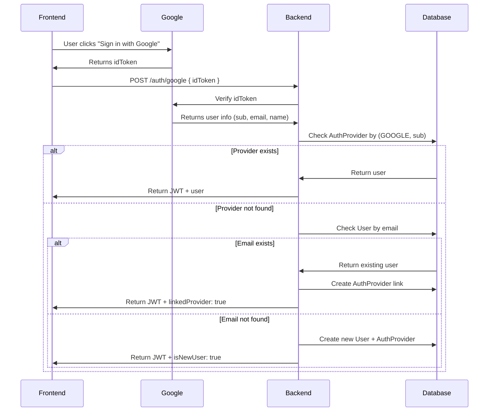

# Google Sign-In API Documentation

## 🔐 Endpoint

```
POST /auth/google
```

## 📝 Request Body

```json
{
  "idToken": "eyJhbGciOiJSUzI1NiIsImtpZCI6...",
  "role": "BUYER"  // Optional: "BUYER" or "ARCHITECT", defaults to "BUYER"
}
```

## ✅ Success Response (200 OK)

### Existing User
```json
{
  "success": true,
  "data": {
    "user": {
      "id": "uuid",
      "email": "user@gmail.com",
      "name": "John Doe",
      "role": "BUYER"
    },
    "token": "eyJhbGciOiJIUzI1NiIsInR5cCI6...",
    "isNewUser": false,
    "linkedProvider": true  // Only present if Google was just linked to existing account
  }
}
```

### New User
```json
{
  "success": true,
  "data": {
    "user": {
      "id": "uuid",
      "email": "newuser@gmail.com",
      "name": "Jane Smith",
      "role": "BUYER"
    },
    "token": "eyJhbGciOiJIUzI1NiIsInR5cCI6...",
    "isNewUser": true
  }
}
```

## ❌ Error Responses

### 400 Bad Request
```json
{
  "success": false,
  "error": "Google ID token is required"
}
```

```json
{
  "success": false,
  "error": "Invalid role"
}
```

### 401 Unauthorized
```json
{
  "success": false,
  "error": "Invalid Google token"
}
```

### 500 Internal Server Error
```json
{
  "success": false,
  "error": "Internal server error"
}
```

## 🔄 Authentication Flow



## 🧪 Testing

### Manual Test with curl

1. Get a Google ID token from frontend or use Google OAuth Playground
2. Test the endpoint:

```bash
curl -X POST http://localhost:3001/auth/google \
  -H "Content-Type: application/json" \
  -d '{
    "idToken": "YOUR_GOOGLE_ID_TOKEN_HERE",
    "role": "BUYER"
  }'
```

### Test Cases

#### ✅ Test 1: New Google User
- **Setup**: Use a Google account that hasn't signed up before
- **Expected**: New user created, `isNewUser: true`
- **Database**: New User + AuthProvider records created

#### ✅ Test 2: Existing Email User (Email/Password)
- **Setup**: 
  1. Register with email/password: POST /auth/register
  2. Sign in with Google using same email
- **Expected**: Google provider linked, `linkedProvider: true`
- **Database**: New AuthProvider record, existing User unchanged

#### ✅ Test 3: Returning Google User
- **Setup**: Sign in with same Google account twice
- **Expected**: Same user returned, `isNewUser: false`
- **Database**: No new records created

#### ❌ Test 4: Invalid Token
- **Setup**: Send random string as idToken
- **Expected**: 401 Unauthorized
- **Response**: "Invalid Google token"

#### ❌ Test 5: Invalid Role
- **Setup**: Send role: "ADMIN"
- **Expected**: 400 Bad Request
- **Response**: "Invalid role"

## 🔒 Security Features

✅ **Server-side verification**: Token verified with Google, not trusted from frontend  
✅ **Audience check**: Ensures token is for this app  
✅ **Email verification**: Only verified Google emails accepted  
✅ **Atomic operations**: Transaction ensures User + AuthProvider created together  
✅ **No duplicates**: Unique constraint on (provider, providerUserId)  
✅ **Account linking**: Existing users can add Google login  

## 📊 Database Changes

### AuthProvider Table (Created in Step 2)
```prisma
model AuthProvider {
  id              String   @id @default(uuid())
  provider        AuthProviderType  // GOOGLE
  providerUserId  String            // Google 'sub'
  userId          String
  user            User     @relation(...)
  createdAt       DateTime @default(now())
  
  @@unique([provider, providerUserId])
  @@index([userId])
}
```

## 🎯 Next Steps

- **Step 4**: Add Apple Sign-In backend
- **Step 5**: Frontend Google button integration
- **Step 6**: Frontend Apple button integration

## 📝 Environment Variables Required

```bash
GOOGLE_CLIENT_ID=YOUR_CLIENT_ID.apps.googleusercontent.com
```

Get your Google Client ID:
1. Go to [Google Cloud Console](https://console.cloud.google.com)
2. Create/select project
3. Enable Google+ API
4. Create OAuth 2.0 credentials (Web application)
5. Copy Client ID
